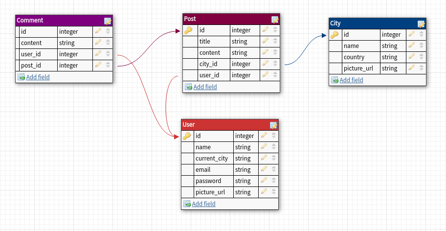

# FellowshipAdvisor

platform to write about your travelling experiences and share with everyone :)

#### contributers:
 - Natalia Hess       (nathess91)
 - Kenneth Bushman    (kbbushman)
 - Sherri Aminshahidy (sherri010)

#### Technologies:
 - HTML5 / CSS3
 - jQuery
 - Bootstrap
 - Ruby on Rails
 - PostgreSQL
 - friendly_id
 
#### Development Period:
  3 days 
#### Wireframes:
 
 
#### Data Models:
 

did I mention this was my first ever rails app?

